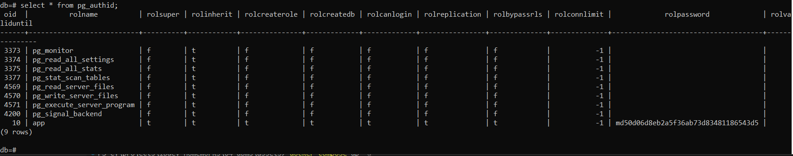
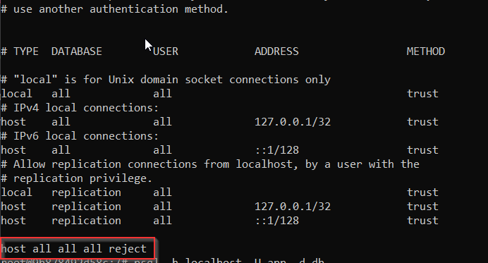
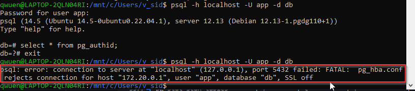
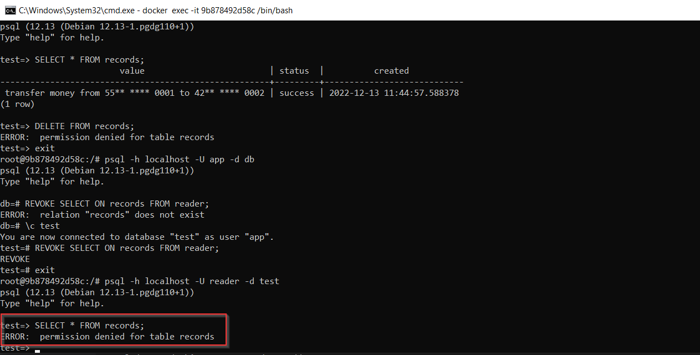

### Результаты выполнения задания

Пришлите в личном кабинете студента ответы на вопросы, указанные в разделе **«Выполнение»**:
1. Какие методы аутентификации используются для подключения по TCP/IP с адресов 127.0.0.1/32 и ::1/128?  
`Разрешены любые подключения, под любым пользователем без пароля`  
2. Какие методы аутентификации используются для подключения по TCP/IP со всех остальных адресов, кроме указанных в предыдущем пункте по протоколу?  
`Разрешены подключения с указанием пароля пользовтаеля (md5 или scram-sha-256) `  
3. Верно ли утверждение: пароль роли `app` хранится в виде `функция_хеширования password` (пароль хранится в поле `rolpassword`)? Если не верно, то приведите описание алгоритма, который используется для хранения хеша.  
Для md5: `md5(password + username)`  
Для scram-sha-256: `SCRAM-SHA-256$<iteration count>:<salt>$<StoredKey>:<ServerKey>`  
Пример: `SCRAM-SHA-256$4096:nEYxO97qeT9i89Zrkegoxw==$aSEM7ph+TydluWFRXFLSJ9Aqen2qtGw/lkH1rePRYBk=:w2pW48qqsaMvPfzWZmUAbeNoOctBnK2myx35XM7XJLo=`  
4. Какое значение имеют поля `rolsuper`, `rolcreaterole`, `rolcreatedb`, `rolbypassrls` с указанием назначения данных столбцов? `t` будет означать «да», `f` — «нет». См. https://postgrespro.ru/docs/postgresql/12/catalog-pg-authid.  

| Column         | Value  | Desc       
|----------------|--------|------------
| rolsuper       | `Да`   | Роли имеет права суперпользователя 
| rolcreaterole  | `Да`   | Роль может создавать другие роли       
| rolcreatedb    | `Да`   | Роль может создавать базы данных       
| rolbypassrls   | `Да`   | Роль не подчиняется никаким политикам защиты |  

5. Почему значения полей `rolcanlogin` и `rolpassword` для роли `app` не изменились, и вы по-прежнему можете подключиться с помощью `psql` без указания пароля, хотя в `pg_hba.conf` для `host all all all` указано `reject`?  
Пользователь не может зайти с другого хоста, но при подключении из контейнера доступ разрешен по двум правилам: по сокету и по ip-маске

  

  

## Задание «CIS PostgreSQL Benchmarks»

Пришлите в личном кабинете студента ответы на вопросы.
1. Какие методы **не рекомендуется** использовать для удалённых подключений?  
`Методы trust, password и ident не должны использоваться для удаленного входа в систему.`  
2. Какие методы **рекомендуется** использовать для удалённых подключений?  
`md5 является
наиболее популярным и может использоваться как в зашифрованных, так и в незашифрованных сеансах, однако он
уязвим для атак с повторным использованием пакетов. Рекомендуется использовать scram-sha-256
вместо md5.`

## Задание «PostgreSQL ПРД»  

  