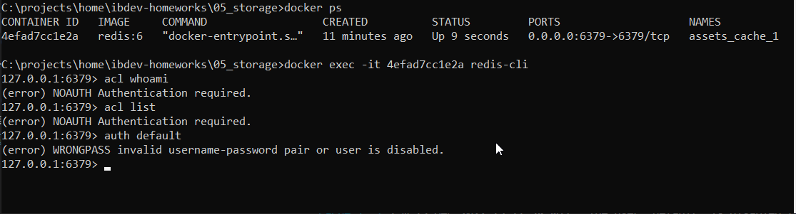
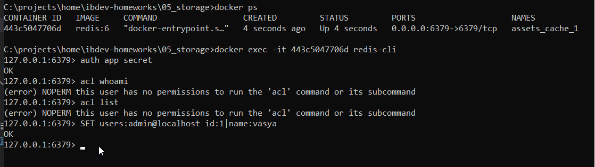
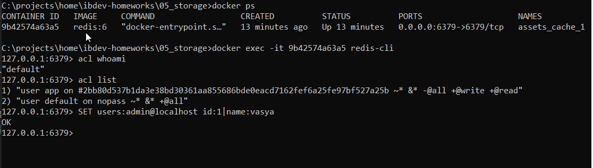

## Задание «Redis ACL»

### Результаты выполнения задания

Пришлите в личном кабинете студента ответы на вопросы, указанные в разделе **«Выполнение»**:
1. По части 2: выводы команд `ACL WHOAMI`, `ACL LIST`, `AUTH default`.  
  
2. По части 3: выводы команд `ACL WHOAMI`, `ACL LIST`.  
  
3. По части 4: выводы команд `ACL WHOAMI`, `ACL LIST`.  
  

## Задание «Redis ACL LOGS»*  

### Результаты выполнения задания  

Пришлите в личном кабинете студента записи из лога событий ACL для событий:
- попытка входа с неверным паролем;
- попытка доступа к неразрешённой команде.

```
C:\projects\home\ibdev-homeworks\05_storage>docker ps
CONTAINER ID   IMAGE     COMMAND                  CREATED         STATUS         PORTS                    NAMES
04426c5273bd   redis:6   "docker-entrypoint.s…"   5 seconds ago   Up 4 seconds   0.0.0.0:6379->6379/tcp   assets_cache_1

C:\projects\home\ibdev-homeworks\05_storage>docker exec -it 04426c5273bd redis-cli
127.0.0.1:6379> acl whoami
(error) NOAUTH Authentication required.
127.0.0.1:6379> auth default UT]PE6WStAtg="6
Invalid argument(s)
127.0.0.1:6379> auth default 'UT]PE6WStAtg="6'
(error) WRONGPASS invalid username-password pair or user is disabled.
127.0.0.1:6379> auth default 'UT]PE6WStAtg="6q'
OK
127.0.0.1:6379> auth app secre
(error) WRONGPASS invalid username-password pair or user is disabled.
127.0.0.1:6379> auth app secret
OK
127.0.0.1:6379> acl list
(error) NOPERM this user has no permissions to run the 'acl' command or its subcommand
127.0.0.1:6379> SET users:admin@localhost id:1|name:vasya
OK
127.0.0.1:6379> auth default 'UT]PE6WStAtg="6q'
OK
127.0.0.1:6379> auth log
(error) WRONGPASS invalid username-password pair or user is disabled.
127.0.0.1:6379> acl log
1)  1) "count"
    2) (integer) 1
    3) "reason"
    4) "auth"
    5) "context"
    6) "toplevel"
    7) "object"
    8) "auth"
    9) "username"
   10) "default"
   11) "age-seconds"
   12) "8.0429999999999993"
   13) "client-info"
   14) "id=3 addr=127.0.0.1:54878 laddr=127.0.0.1:6379 fd=7 name= age=237 idle=0 flags=N db=0 sub=0 psub=0 multi=-1 qbuf=23 qbuf-free=40931 argv-mem=7 obl=0 oll=0 omem=0 tot-mem=61463 events=r cmd=auth user=default redir=-1"
2)  1) "count"
    2) (integer) 1
    3) "reason"
    4) "command"
    5) "context"
    6) "toplevel"
    7) "object"
    8) "acl"
    9) "username"
   10) "app"
   11) "age-seconds"
   12) "63.015000000000001"
   13) "client-info"
   14) "id=3 addr=127.0.0.1:54878 laddr=127.0.0.1:6379 fd=7 name= age=182 idle=0 flags=N db=0 sub=0 psub=0 multi=-1 qbuf=23 qbuf-free=40931 argv-mem=7 obl=0 oll=0 omem=0 tot-mem=61463 events=r cmd=acl user=app redir=-1"
3)  1) "count"
    2) (integer) 1
    3) "reason"
    4) "auth"
    5) "context"
    6) "toplevel"
    7) "object"
    8) "auth"
    9) "username"
   10) "app"
   11) "age-seconds"
   12) "85.546000000000006"
   13) "client-info"
   14) "id=3 addr=127.0.0.1:54878 laddr=127.0.0.1:6379 fd=7 name= age=160 idle=0 flags=N db=0 sub=0 psub=0 multi=-1 qbuf=34 qbuf-free=40920 argv-mem=12 obl=0 oll=0 omem=0 tot-mem=61476 events=r cmd=auth user=default redir=-1"
4)  1) "count"
    2) (integer) 1
    3) "reason"
    4) "auth"
    5) "context"
    6) "toplevel"
    7) "object"
    8) "auth"
    9) "username"
   10) "default"
   11) "age-seconds"
   12) "146.88300000000001"
   13) "client-info"
   14) "id=3 addr=127.0.0.1:54878 laddr=127.0.0.1:6379 fd=7 name= age=99 idle=1 flags=N db=0 sub=0 psub=0 multi=-1 qbuf=49 qbuf-free=40905 argv-mem=26 obl=0 oll=0 omem=0 tot-mem=61490 events=r cmd=auth user=default redir=-1"

```